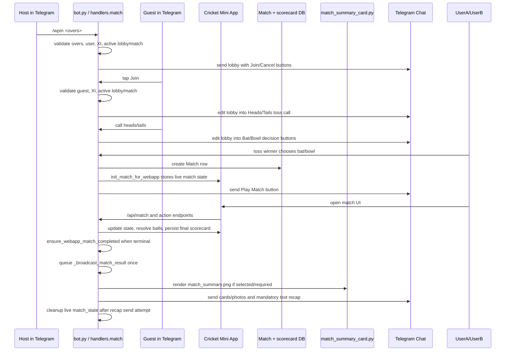

# `/wpm` (`cric_*`) Match Summary to Telegram Mechanism

This document explains how the Telegram Mini App cricket match flow starts a player-vs-player lobby and how the completed match summary is sent back to the originating Telegram chat.

> **Naming note:** in this codebase the public Telegram command is `/wpm`, while the lobby callback data and callback handlers use the `cric_*` prefix (`cric_join`, `cric_coin:*`, `cric_decision:*`).

## Purpose

`/wpm` creates a player-vs-player cricket match lobby in a Telegram chat. After another player joins, the guest calls the toss, the toss winner chooses bat/bowl, and both players complete the match in the Cricket Mini App. When the match reaches a terminal state, the web API finalizes it and queues a Telegram recap back to the original lobby chat.

The recap mechanism sends:

1. the configured completed-match image cards, including the match-summary PNG when enabled/required,
2. a mandatory HTML text recap with scores, winner, margin, key performers, rewards, and a button to reopen the completed match, or
3. a text-only fallback when there was no play or when the summary image could not be rendered.

## Main Files Involved

| File | Responsibility |
| --- | --- |
| `bot.py` | Registers `/wpm` and the `cric_*` Telegram callback handlers. |
| `handlers/match.py` | Creates the lobby, handles join/cancel/toss/decision callbacks, creates the `Match` row, initializes Mini App state, and sends the Play Match message. |
| `services/match_webapp_service.py` | Builds and mutates live Mini App match state, persists final scorecards, and finalizes completed web-app matches. |
| `services/crickidex_arena.py` | Serializes live or completed match state into the Cricket Mini App API shape. |
| `admin.py` | Serves the Cricket Mini App/API endpoints, detects terminal matches, builds final recap text/images, and sends the Telegram completion flow. |
| `services/match_broadcast.py` | Builds Cricket Mini App launch/deep-link URLs, Play Match keyboards, and ready/spectate messages. |
| `services/match_summary_card.py` | Renders the completed-match summary PNG used by the final Telegram recap. |
| `services/match_state_store.py` / `services/match_webapp_access.py` | Store live match state and next-action pointers used by the Mini App engine. |

## End-to-End Flow



## Detailed Mechanism

### 1. `/wpm` creates the lobby

The `/wpm` command accepts an optional overs argument:

```text
/wpm <overs>
```

Important validation and setup steps:

- Defaults to `1` over when no argument is supplied.
- Rejects non-numeric values and values outside `1` to `5` overs.
- Requires the host to have an existing bot account.
- Rejects lobby creation when the chat already has an active Mini App cricket match, the host already has an active match, the chat already has a waiting lobby, or the host is already in another waiting lobby.
- Validates the host playing XI through `handlers.lineup.validate_xi(...)`.
- Stores the lobby in `context.bot_data` with a key derived from the Telegram chat id.
- Sends a Telegram lobby message with `Join Match` and `Cancel Lobby` inline buttons.
- Stores the lobby message id and schedules an auto-expiry job.

### 2. Guest joins and calls the toss

When another user taps `Join Match`, the `cric_join` callback:

- Verifies the lobby exists and is not already full.
- Rejects the host joining their own lobby.
- Requires the guest to have an existing bot account.
- Rejects a join if the chat, host, or guest already has an active/waiting cricket match.
- Validates the guest XI.
- Stores guest details in the lobby.
- Sets the joining guest as the coin-toss caller.
- Cancels the unjoined-lobby expiry job.
- Edits the lobby message into a toss call message with `Heads` and `Tails` buttons.

When the guest taps `Heads` or `Tails`, the `cric_coin:*` callback:

- Verifies only the toss caller can call the toss.
- Runs the animated coin-toss helper.
- Stores the toss winner in the lobby.
- Edits the lobby into a toss-result message with `Bat First` and `Bowl First` buttons.

### 3. Toss decision creates the persisted match and initializes Mini App state

When the toss winner chooses `bat` or `bowl`, the `cric_decision:*` callback:

- Verifies only the toss winner can make the decision.
- Re-checks that both players still exist and neither player/chat has another active Mini App cricket match.
- Creates a `Match` row with host/guest ids, overs, toss winner, toss decision, batting-first/bowling-first ids, random match settings, chat id, and `status='toss'`.
- Calls `services.match_webapp_service.init_match_for_webapp(...)`.
- Removes the in-memory lobby only after successful initialization.
- Edits the toss message with the winner's decision.
- Sends a Play Match message through `services.match_broadcast.send_match_ready_message(...)`.

`init_match_for_webapp(...)` builds the initial live Mini App state by:

- Loading the `Match` row and batting/bowling users.
- Reading each user's ordered XI.
- Creating the engine state through `services.match_engine.create_match_state(...)`.
- Storing chat/origin metadata, Telegram ids, team names, pitch data, setup flags, and `played_via='webapp'`.
- Saving state with next action `SETUP` unless both sides are already auto-confirmed.
- Updating the database match status to `playing`.

### 4. Play Match button opens the Cricket Mini App

`services.match_broadcast` builds launch URLs from the match id and chat id. The ready message uses these URLs in a Play Match/Spectate keyboard so the players can open the Cricket Mini App from the lobby chat.

The Mini App uses `admin.py` API routes to load and mutate state. The important endpoints include:

| Endpoint | Used for |
| --- | --- |
| `GET /api/match` | Polls the serialized match state by `matchId`/viewer. |
| `GET /api/match/state` | Returns the full REST-style match state snapshot. |
| `POST /api/match/select-players` | Confirms opening batsmen and opening bowler during setup. |
| `POST /api/match/action` | Applies generic Mini App match actions. |
| `POST /api/webapp/match/play-shot` | Resolves a batting shot and checks whether the match ended. |

### 5. Match state is serialized, persisted, and restored

The live engine state is kept in the match-state store while the match is active. API serialization is handled by `services.crickidex_arena.serialize_match_state(...)`.

Important state behavior:

1. Active matches serialize directly from live state and next-action pointers.
2. If the `Match` row is already `completed` and live state has been cleaned up, serialization attempts to load the persisted final scorecard's `arena_state` so the completed match can still be reopened.
3. The serializer treats that restored snapshot as `COMPLETED`, preventing the UI from showing a stale turn prompt after a terminal ball.
4. The final Telegram broadcast intentionally keeps live state until after the recap send attempt, then cleans it up.

### 6. Game loop detects terminal completion

After a shot is played through `POST /api/webapp/match/play-shot`, the API:

- resolves the shot with `services.match_webapp_service.play_shot(...)`,
- may advance bot turns for vs-bot matches,
- checks whether the response has `match_over` or whether the next-action pointer is `COMPLETED`, and
- calls `_finalize_and_broadcast_if_terminal(...)` when the match has ended.

`_finalize_and_broadcast_if_terminal(...)` delegates finalization to `ensure_webapp_match_completed(...)`. If finalization returns a result, it queues `_broadcast_match_result(...)` with that result.

### 7. Finalization prepares result data and rewards

The completed result payload and UI overlay are based on final state values including:

- first-innings runs,
- second-innings runs,
- chase target,
- batting side ids for each innings,
- winning side and margin,
- completed rewards already stored in state, and
- Player/Man of the Match calculated as `runs + wickets * 25` when persisted values are unavailable.

The final recap builder also merges missing result fields from the final Arena state if the result object passed into the broadcaster is incomplete.

### 8. Telegram match-summary send

The completed-match Telegram flow is intentionally asynchronous and idempotent:

1. `_broadcast_match_result(match_id, result)` adds the match id to an in-process guard set so duplicate terminal requests do not double-post the recap.
2. A background worker sleeps briefly so the Mini App can render the terminal state immediately.
3. `_build_and_send_match_result(...)` loads the `Match`, final scorecard, and final Arena state.
4. If the persisted scorecard is incomplete, the builder tries to rebuild scorecard rows from still-live state before cleanup.
5. The target chat is resolved in this order: override chat id, `arena.original_lobby_chat_id`, `match.chat_id`, then `arena.chat_id`.
6. If no actual play occurred, the flow skips images and sends a concise text recap only.
7. Otherwise it builds the mandatory HTML recap text with innings scores, winner, margin, top batsman, top bowler, Player of the Match, rewards/spectator note, and an inline button.
8. It reads the admin-configured completed-card selection from `get_wpm_result_cards()`; vs-bot matches force `summary`.
9. It renders selected innings cards and the summary card in a thread pool, falling back to serial rendering if parallel rendering fails.
10. If `summary` is required but the image is missing, it appends a visible text fallback warning.
11. `_send_completed_match_cards(...)` sends images by `sendPhoto` or `sendMediaGroup`, then always sends the mandatory result text via `sendMessage` with the reopen button.
12. After a successful build/send attempt, the background worker removes the live match state.

## Scoreboard / Summary Image Generation

`services/match_summary_card.py` renders the match-summary PNG using Pillow. The renderer creates a 2048×1280 card with:

- a dark broadcast-style design,
- a large match header,
- a stadium strip,
- separate innings panels,
- a result bar,
- top batting/bowling performers, and
- a Player of the Match footer.

`admin.py` adapts the persisted final scorecard and Arena state into the renderer's expected arguments in `_build_match_summary_image(...)`. If the persisted scorecard lacks both innings, it can build innings rows from final Arena state before rendering.

## Important Runtime State

| State | Location | Notes |
| --- | --- | --- |
| Lobby state | `context.bot_data[_cric_lobby_key(chat_id)]` | Waiting `/wpm` lobby keyed by Telegram chat id. |
| Match row | `models.Match` | Stores players, overs, toss metadata, chat id, match status, timestamps, and random settings. |
| Live Arena state | `services.match_state_store` / `services.match_webapp_access` | Mutable ball-by-ball Mini App engine state and next-action pointer. |
| Final scorecard snapshot | `services.match_webapp_service.load_final_scorecard(...)` | Persisted completed scorecard and `arena_state`, used for later reopens and final recap building. |
| Broadcast guard | `admin.py` `_COMPLETED_MATCH_BROADCASTS` | Prevents duplicate completed-match Telegram flows. |

## Failure and Fallback Behavior

- Invalid overs: `/wpm` replies with `/wpm <overs (1-5)>` usage.
- Missing host/guest account: the flow asks the user to run `/debut`.
- Invalid host/guest XI: lobby creation or join fails.
- Duplicate lobby/match: the bot rejects the action before creating or launching a match.
- Lobby expiry: an unjoined lobby auto-cancels and edits/sends an expiry message.
- Mini App state missing for completed match: serialization attempts to load the persisted final Arena snapshot.
- Persisted scorecard incomplete during recap: final recap builder tries a live-state rebuild before cleanup.
- No-play completion: images are skipped and a text recap explains there is no scorecard.
- Summary image render failure: the result text is sent with a visible summary-image fallback warning.
- Photo/album send failure: the sender retries album cards individually where applicable and still attempts the mandatory text result message.
- Broadcast worker failure: the idempotency guard is cleared so a later self-heal path can retry.

## Quick Trace: Lobby to Telegram Summary

1. Host sends `/wpm 2`.
2. Bot validates host account, active-match conflicts, and XI, then posts a lobby.
3. Guest taps `Join Match`.
4. Bot validates guest account, active-match conflicts, and XI, then asks the guest to call the toss.
5. Guest calls heads/tails.
6. Bot flips the coin and shows `Bat First` / `Bowl First` to the toss winner.
7. Toss winner chooses bat/bowl.
8. Bot creates a `Match`, initializes Mini App state, removes the lobby, and posts the Play Match button.
9. Players open the Cricket Mini App and play through API actions.
10. A terminal ball sets `match_over` or the next-action pointer to `COMPLETED`.
11. API finalization queues the one-time background recap worker.
12. Worker loads/rebuilds final scorecard data, renders configured cards, sends photos/media where available, sends the mandatory text recap to the original lobby chat, and finally cleans up live match state.
